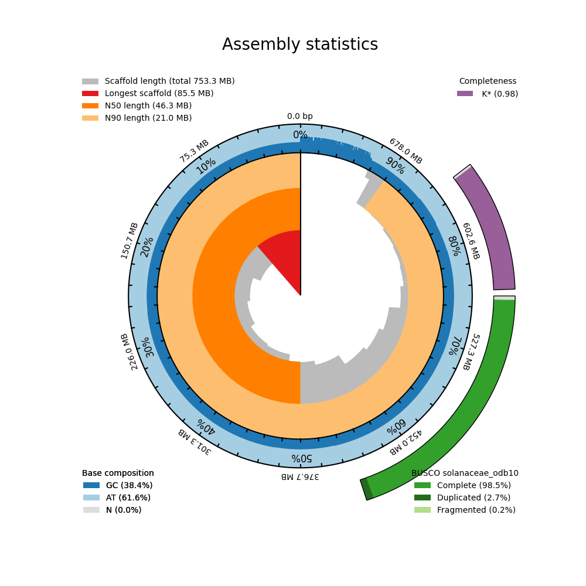

# pysnailplot

- [x] Plots scaffolds sorted by size
- [x] Provides and visualises basic assembly statistics (N50, N90, etc)
- [x] Calculates and plots scaffold GC content
- [x] Calculates and plots N content
- [x] Integrates optional BUSCO scores
- [x] Can integrate kmer completeness value
- [ ] Correctly differentiates between contigs and scaffolds

A python program to generate blobtoolkit "snail plots". Simply call on the fasta file of your assembly and generate a snail in seconds!

I created this to streamline the process of generating a snailplot.
Currently, you have to use a perl script to generate summary statistics, then set up an HTTP server to load the interactive plot.
This merges the two steps and generates a static plot suitable for quick exploration, or publication.

Currently a very early version!

